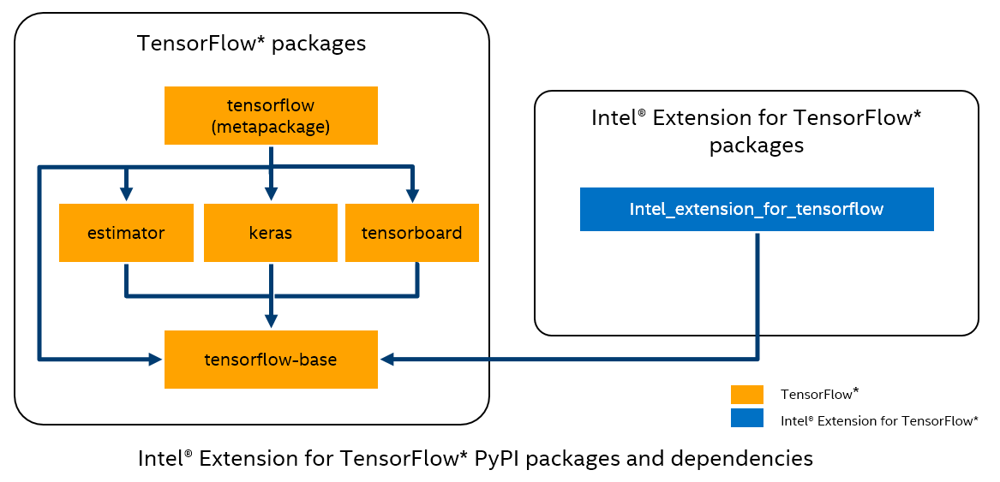

<div align="center">

Intel® Extension for TensorFlow*
===============================

[](https://badge.fury.io/py/intel-extension-for-tensorflow)
[](https://badge.fury.io/py/intel-extension-for-tensorflow)
[](https://github.com/intel/intel-extension-for-tensorflow/releases)
[](LICENSE.txt)

[🏭Infrastructure](./docs/guide/infrastructure.md)&nbsp;&nbsp;&nbsp;|&nbsp;&nbsp;&nbsp;[📖Documentations](./docs/README.md)&nbsp;&nbsp;&nbsp;|&nbsp;&nbsp;&nbsp;[🌱Features](https://intel.github.io/intel-extension-for-tensorflow/latest/docs/guide/features.html)&nbsp;&nbsp;&nbsp;|&nbsp;&nbsp;&nbsp;[😃Performance Data](https://intel.github.io/intel-extension-for-tensorflow/latest/docs/guide/performance.html)&nbsp;&nbsp;&nbsp;|&nbsp;&nbsp;&nbsp;[🏃Installation Guide](https://intel.github.io/intel-extension-for-tensorflow/latest/docs/install/installation_guide.html)&nbsp;&nbsp;&nbsp;|&nbsp;&nbsp;&nbsp;[💻Examples](./examples/README.md)
</div>


Intel® Extension for TensorFlow* is a heterogeneous, high performance deep learning extension plugin based on TensorFlow [PluggableDevice](https://github.com/tensorflow/community/blob/master/rfcs/20200624-pluggable-device-for-tensorflow.md) interface, aiming to bring Intel CPU or GPU devices into [TensorFlow](https://github.com/tensorflow/tensorflow) open source community for AI workload acceleration. It allows users to flexibly plug an XPU into TensorFlow on-demand, exposing the computing power inside Intel's hardware.

This diagram provides a summary of the TensorFlow* PyPI package ecosystem.

<div align=center>

</div>


* TensorFlow PyPI packages:
  [estimator](https://www.tensorflow.org/guide/estimator), [keras](https://keras.io), [tensorboard](https://www.tensorflow.org/tensorboard), [tensorflow-base](https://www.tensorflow.org/guide)

* Intel® Extension for TensorFlow* package:

   `intel_extension_for_tensorflow` contains:
   * XPU specific implementation
     * Kernels & operators
     * Graph optimizer
     * Device runtime
   * XPU configuration management
     * XPU backend selection
     * Options turning on/off advanced features

## Install

### Hardware Requirement

Intel® Extension for TensorFlow* provides [Intel XPU](docs/install/install_for_xpu.md#hardware-requirements) and [Intel CPU](docs/install/install_for_cpu.md#hardware-requirements) support.

### Software Requirement

|Package|CPU|XPU|Installation|
|-|-|-|-|
|Intel GPU driver||Y|[Install Intel GPU driver](docs/install/install_for_xpu.md#install-gpu-drivers)|
|Intel® oneAPI Base Toolkit||Y|[Install Intel® oneAPI Base Toolkit](docs/install/install_for_xpu.md#install-oneapi-base-toolkit-packages)|
|TensorFlow|Y|Y|[Install TensorFlow 2.15.0](https://www.tensorflow.org/install)|

### Installation Channel:
Intel® Extension for TensorFlow* can be installed through the following channels:

* PyPI: [XPU](docs/install/install_for_xpu.md#install-via-pypi-wheel-in-bare-metal) \ [CPU](docs/install/install_for_cpu.md#install-via-pypi-wheel-in-bare-metal)
* DockerHub: [ XPU Container ](docs/install/install_for_xpu.md#install-via-docker-container) \ [ CPU Container](docs/install/install_for_cpu.md#install-via-docker-container)
* Source: [Build from source](docs/install/how_to_build.md)


### Compatibility Table

| Intel® Extension for TensorFlow*  | Stock TensorFlow |
| ------- | ----------- |
| Not support  | 2.17 |
| [latest build from source](docs/install/how_to_build.md)  | 2.16 |
| v2.15.0.0 & v2.15.0.1  | 2.15 |
| v2.14.0.1 & v2.14.0.2  | 2.14 |
| v2.13.0.0  | 2.13 |
| v1.2.0  | 2.12 |
| v1.1.0  | 2.10 & 2.11 |
| v1.0.0  | 2.10        |

### Install for XPU
```
pip install --upgrade intel-extension-for-tensorflow[xpu]
```

Environment check instructions for XPU:

* Option1:
```bash
pip install wget
export path_to_site_packages=`python -c "import site; print(site.getsitepackages()[0])"`
python ${path_to_site_packages}/intel_extension_for_tensorflow/tools/python/env_check.py
```

* Option2:
```bash
pip install wget
wget https://raw.githubusercontent.com/intel/intel-extension-for-tensorflow/main/tools/python/env_check.py
python env_check.py
```

Refer to [XPU installation](docs/install/install_for_xpu.md) for details.

### Install for CPU
```
pip install --upgrade intel-extension-for-tensorflow[cpu]
```

Sanity check instructions:
```
python -c "import intel_extension_for_tensorflow as itex; print(itex.__version__)"
```

### Install for weekly binaries

#### Install for XPU weekly
```
pip install --upgrade intel-extension-for-tensorflow-weekly[xpu] -f https://developer.intel.com/itex-whl-weekly
```

Environment check instructions for GPU weekly:

* Option1:
```bash
pip install wget
export path_to_site_packages=`python -c "import site; print(site.getsitepackages()[0])"`
python ${path_to_site_packages}/intel_extension_for_tensorflow/tools/python/env_check.py
```

* Option2:
```bash
pip install wget
wget https://raw.githubusercontent.com/intel/intel-extension-for-tensorflow/main/tools/python/env_check.py
python env_check.py
```

#### Install for CPU weekly
```
pip install --upgrade intel-extension-for-tensorflow-weekly[cpu] -f https://developer.intel.com/itex-whl-weekly
```

Sanity check instructions:
```
python -c "import intel_extension_for_tensorflow as itex; print(itex.__version__)"
```

## Building with oneDNN Threadpool (Alternative to OpenMP)

By default, the CPU backend in Intel® Extension for TensorFlow* is configured with the OpenMP (OMP) threading runtime. ITEX also supports the **oneDNN Threadpool runtime**, which attaches oneDNN operations directly to TensorFlow's native Eigen threadpool.

### Why Choose Threadpool?
- **Avoids Thread Over-Subscription**: Eliminates CPU core contention and context-switching overhead caused by competing OpenMP and TensorFlow thread pools.
- **Lower Latency for Multi-Tenant / Concurrent Inference**: Delivers superior performance for high inter-op concurrency and small batch workloads.
- **Unified Thread Management**: Thread allocation is controlled directly via standard TensorFlow threading APIs rather than separate OpenMP environment variables.

### Build Commands

1. **Configure the Workspace**:
   ```bash
   ./configure
   ```

2. **Build C++ Shared Library with Threadpool**:
   ```bash
   bazel build -c opt --config=cpu --define=build_with_threadpool=true //itex:libitex_cpu_cc.so
   ```

3. **Build Python Pip Package with Threadpool**:
   ```bash
   bazel build -c opt --config=cpu --define=build_with_threadpool=true //itex/tools/pip_package:build_pip_package
   ./bazel-bin/itex/tools/pip_package/build_pip_package WHL/
   ```

4. **Install the Generated Wheel**:
   ```bash
   pip install WHL/intel_extension_for_tensorflow*.whl
   ```

### Runtime Verification
To verify that the Threadpool runtime is active:
```bash
ITEX_DEBUG_WIRING=1 python -c "import intel_extension_for_tensorflow as itex; import tensorflow as tf; tf.matmul(tf.ones([2,2]), tf.ones([2,2]))"
```
Look for log output:
```text
ITEX_DEBUG_WIRING component=onednn_threadpool event=adapter_created ...
```

### Performance Tuning
Configure thread concurrency using TensorFlow's threading configuration:
```python
import tensorflow as tf

# Set intra-op and inter-op threads (aligned with physical CPU cores)
tf.config.threading.set_intra_op_parallelism_threads(16)
tf.config.threading.set_inter_op_parallelism_threads(2)
```

## Documentation

Visit the [online document website](https://intel.github.io/intel-extension-for-tensorflow/latest/), and then get started with a tour of Intel® Extension for TensorFlow* [examples](examples/README.md).

## Contributing

We welcome community contributions to Intel® Extension for TensorFlow*.

This project is intended to be a safe, welcoming space for collaboration, and contributors are expected to adhere to the [Contributor Covenant](CODE_OF_CONDUCT.md). Please see [contribution guidelines](docs/community/contributing.md) for additional details.

## Resources
- [TensorFlow GPU device plugins](https://www.tensorflow.org/install/gpu_plugins)
- [Accelerating TensorFlow on Intel® Data Center GPU Flex Series](https://blog.tensorflow.org/2022/10/accelerating-tensorflow-on-intel-data-center-gpu-flex-series.html)
- [Meet the Innovation of Intel AI Software: Intel® Extension for TensorFlow*](https://www.intel.com/content/www/us/en/developer/articles/technical/innovation-of-ai-software-extension-tensorflow.html)
- [Efficient TensorFlow Distributed Training on Intel Data Center GPU Max Series](https://medium.com/intel-analytics-software/efficient-tensorflow-distributed-training-on-intel-data-center-gpu-max-series-c01f3043a0cc)
- [Accelerate JAX models on Intel GPUs via PJRT](https://opensource.googleblog.com/2023/06/accelerate-jax-models-on-intel-gpus-via-pjrt.html)
- [Running TensorFlow Stable Diffusion on Intel Arc GPUs](https://medium.com/intel-analytics-software/running-tensorflow-stable-diffusion-on-intel-arc-gpus-e6ff0d2b7549)
- [AI workload Acceleration with Intel® Extension for TensorFlow* | Intel Software](https://www.youtube.com/watch?v=Wivx0IYKzpk)

## Support
Submit your questions, feature requests, and bug reports on the [GitHub issues](https://github.com/intel/intel-extension-for-tensorflow/issues) page.

## Security
See Intel's [Security Center](https://www.intel.com/content/www/us/en/security-center/default.html) for information on how to report a potential security issue or vulnerability.

See also: [Security Policy](SECURITY.md)

## License
[Apache License 2.0](LICENSE.txt)

This distribution includes third party software governed by separate license terms. This third party software, even if included with the distribution of the Intel software, may be governed by separate license terms, including without limitation, third party license terms, other Intel software license terms, and open source software license terms. These separate license terms govern your use of the third party programs as set forth in the ["THIRD-PARTY-PROGRAMS"](third-party-programs/THIRD-PARTY-PROGRAMS) file.
